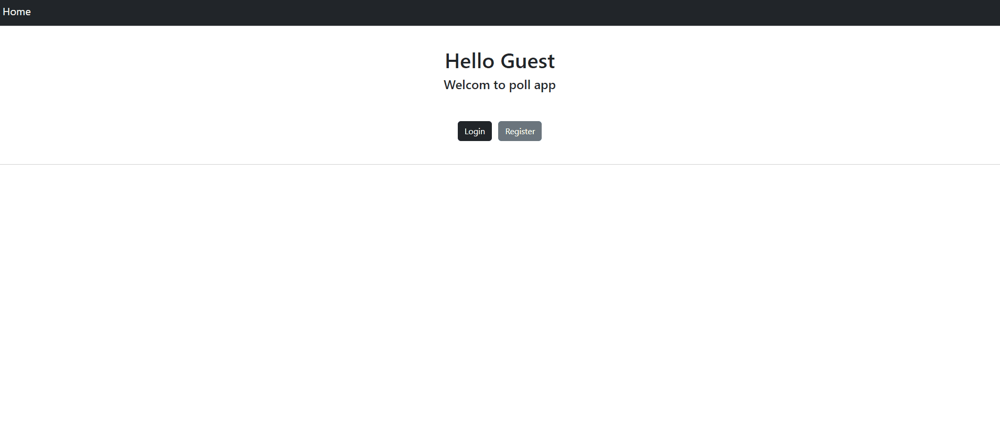

# Django Polling App(DRF)

The user has to authenticate to show the polls and to vote. If the user already voted can not vote again.

## Features

- Django 4.1
- Django RestFramework
- JWT
- User authentication
- Bootstrap 5

## Demo



### Setup

```
git clone https://github.com/ali-abbaszade/poll_app.git
```

Create virtual environment and activate

```
python -m venv venv

windows: venv\Scripts\activate
linux: source venv/bin/activate
```

Install the dependencies of the project

```
pip install -r requirements.txt
```

Create all migrations file then apply the migrations

```
python manage.py makemigrations

python manage.py migrate
```

Start the server and run the app

```
python manage.py runserver
```
